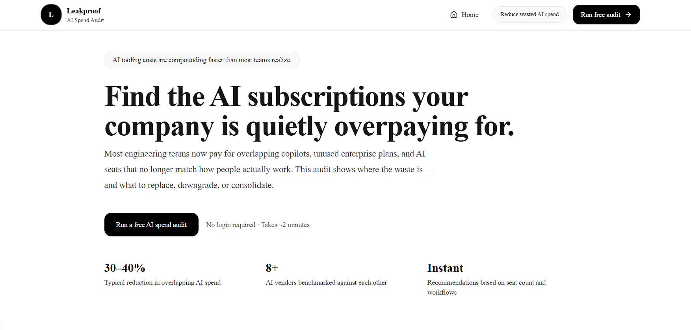

# README.md

# Leakproof — AI Spend Audit

Leakproof is a free AI spend audit tool 
for startup engineering teams. Enter the 
AI tools your team pays for — ChatGPT, 
Claude, Cursor, Copilot, APIs — and get 
an instant breakdown of where you are 
overspending, what to switch, and how 
much you could save per month.

Built as a Credex assignment exploring 
whether a free audit tool could work as 
a customer acquisition wedge for 
discounted AI infrastructure credits.

**Live:** https://leakproof-gules.vercel.app

---

## Screenshots

### Landing page


### Audit results


### Twitter OG preview


## Quick start

### 1. Clone

```bash
git clone https://github.com/Yashkadam1234/leakproof.git
cd leakproof
```

### 2. Install

```bash
npm install
```

### 3. Environment variables

Create `.env.local`:

```env
NEXT_PUBLIC_SUPABASE_URL=
NEXT_PUBLIC_SUPABASE_ANON_KEY=
SUPABASE_SERVICE_ROLE_KEY=
ANTHROPIC_API_KEY=
RESEND_API_KEY=
NEXT_PUBLIC_APP_URL=http://localhost:3000
```

### 4. Run

```bash
npm run dev
```

Visit `http://localhost:3000`

---

## Environment variables

**NEXT_PUBLIC_SUPABASE_URL**
Public Supabase project URL. Used by 
both frontend and API routes.

**NEXT_PUBLIC_SUPABASE_ANON_KEY**
Public anonymous Supabase key for 
client-side access.

**SUPABASE_SERVICE_ROLE_KEY**
Private service key used in API routes 
for writing audits and leads. Never 
expose client-side.

**ANTHROPIC_API_KEY**
Used to generate personalized audit 
summaries. Falls back to a template 
summary automatically if empty or 
if the API call fails.

**RESEND_API_KEY**
Sends transactional confirmation emails 
after lead capture. Free tier only sends 
to your verified email — custom domain 
needed for production.

**NEXT_PUBLIC_APP_URL**
Base URL used for OG image generation 
and shareable audit links. Set to your 
Vercel URL in production.

---

## Decisions

### 1. Hardcoded rules for audit logic, 
not AI

Every recommendation in the audit engine 
traces to a specific pricing rule — seat 
count, plan fit, documented price 
differences. I deliberately avoided using 
an LLM for the savings estimates.

The reason: a finance person reading the 
output should be able to verify every 
number independently. If the reasoning 
is "the AI said so" it falls apart 
immediately under scrutiny. Hardcoded 
rules are testable, explainable, and 
auditable. There are 8 Vitest tests 
covering the engine specifically.

The tradeoff is that edge cases require 
manual rule additions. An LLM approach 
would generalize better but would be 
much harder to trust.

### 2. Next.js App Router over Pages Router

The app has public landing pages, API 
routes, server-rendered dynamic pages, 
OG image generation, and shareable URLs 
with metadata. App Router handled all 
of that cleanly in one framework.

The tradeoff was friction I did not 
expect — Next.js 15 changed params to 
be a Promise, which broke the audit 
results page in a way that took time 
to debug because the error message was 
not obvious. Pages Router would not 
have had that issue but the route 
organization would have been messier.

### 3. Supabase over PlanetScale or Neon

I needed hosted Postgres with fast setup 
and dashboard visibility into the data. 
Supabase gave me that in about 20 minutes.

The tradeoff I hit: Supabase column names 
must be snake_case but my TypeScript 
interfaces used camelCase. The insert 
calls failed silently with a schema 
cache error that took longer than it 
should have to connect to the actual 
cause. Would set up stricter type mapping 
between the DB layer and application 
layer from day one next time.

### 4. Resend over SendGrid

Resend's developer experience is 
genuinely cleaner. One import, one 
function call, works. SendGrid's 
free tier has more setup friction 
for a project this size.

The real limitation: Resend free tier 
only sends to your verified email until 
you add a custom domain. Confirmation 
emails land in spam during development. 
Fine for a one-week build, would need 
to fix before a real launch.

### 5. nanoid for slugs over UUID

Audit URLs needed to be short enough 
to share comfortably. nanoid generates 
10-character URL-safe identifiers. 
A UUID would make the share URL look 
like a database artifact rather than 
a real product URL.

The tradeoff is a smaller randomness 
space than UUID. At the scale this 
tool would realistically operate that 
is not a real concern — the collision 
probability is negligible until you 
are generating millions of audits.

---

## Running tests

```bash
npm run test
```

Watch mode:
```bash
npm run test:watch
```

Type check:
```bash
npm run type-check
```

Lint:
```bash
npm run lint
```

---

## CI

GitHub Actions runs lint, type-check, 
and tests on every push to main. 
See `.github/workflows/ci.yml`.